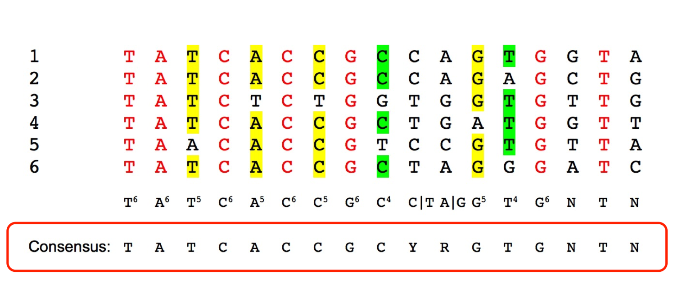
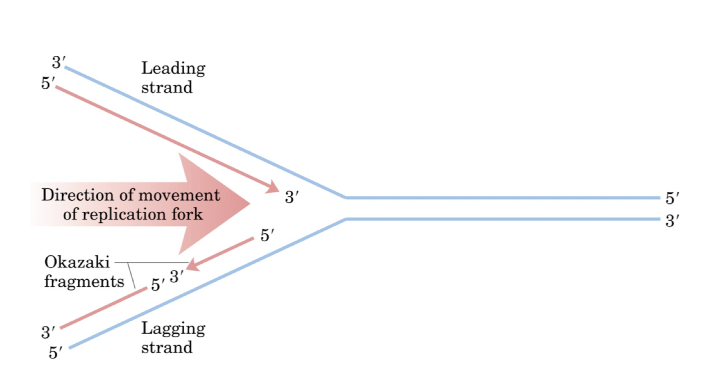
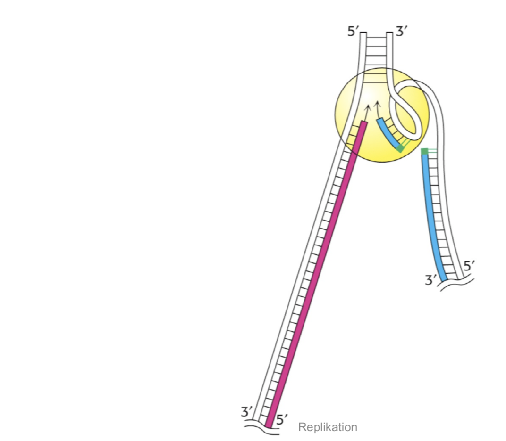
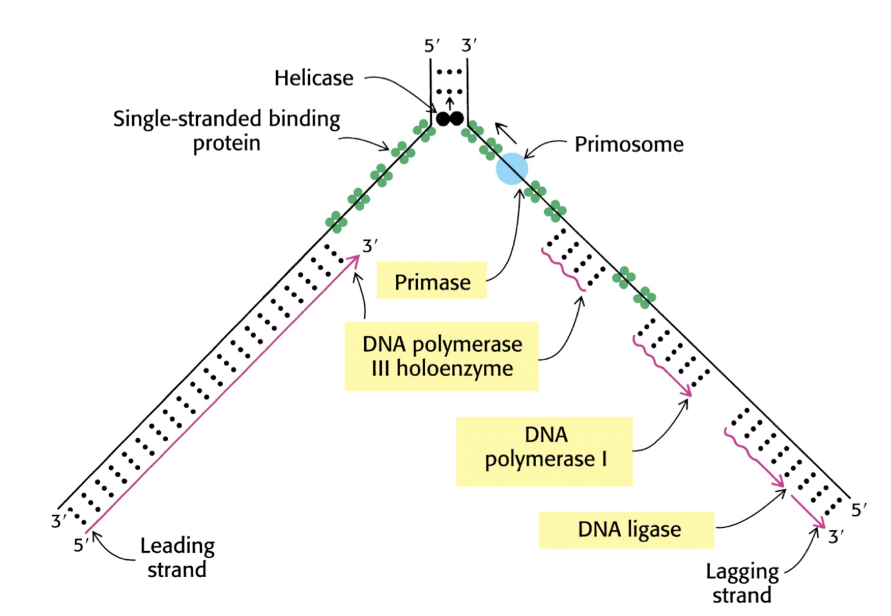
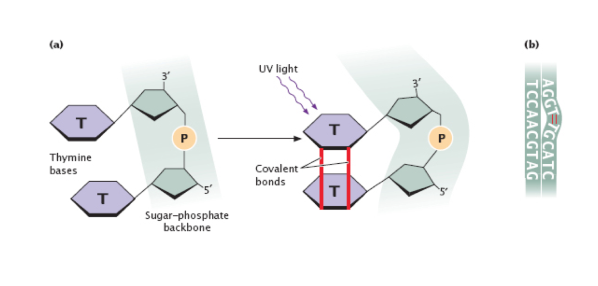
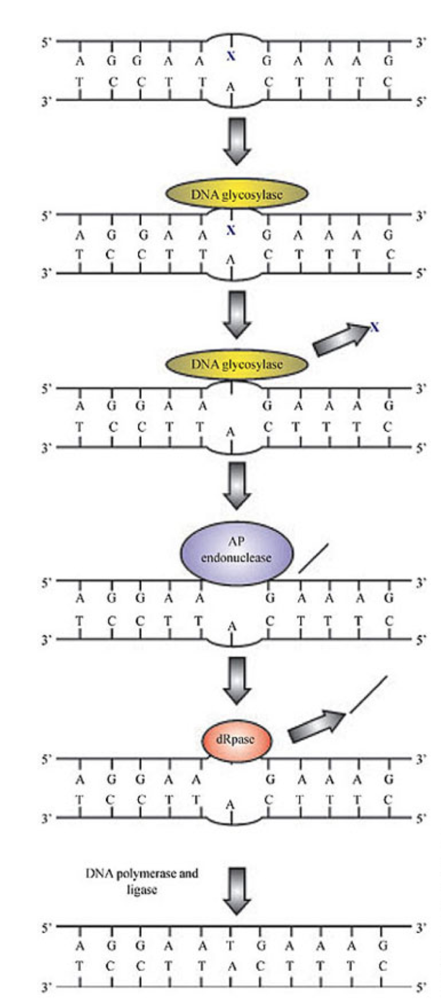
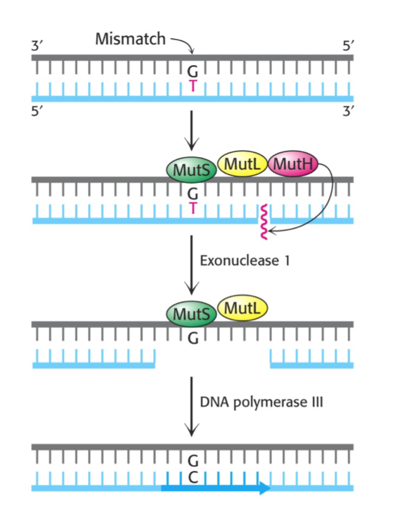

# Zentrales Dogma der Molekularbiologie

- DNA
    - ständige Replikation
- Transkription zu RNA
- Translation zu Proteinen

# Replikation bei Prokaryoten
- Semikonservativ &rightarrow; an beiden Strängen gleichzeitig 

## Replikationsschema der DNA
### 3 versch. Hypothesen
- Konservativ?
    - &rightarrow; Die DNA bleibt immer erhalten, ein zweite, völlig neuer entsteht
-Semikonservativ? 
    - &rightarrow; ein DNA Strang bleibt erhalten, daran bildet sich ein neuer Strang
- Dispersiv?
    - &rightarrow; nur Teile eines Stranges bleiben erhalten, der Rest bildet sich neu

### Antwort durch Meselson-Stahl-Experiment
- Züchtung von Bakterien auf Stickstoffisotopen mit unterschiedlichem Gewicht 
    - &rightarrow; Stickstoff wird in die DNA mit eiingebaut

- Bakterien wurden erst auf Medium mit schwerem Stickstoff gezüchtet
    - &rightarrow; nur schwere DNA
- Anschließende Überführung der Bakterien auf Medium mit leichtem Stickstoff für Replikation
- Nutzung des Dichtegradientenverfahrens &rightarrow; Auftrennung der Stoffe entlang ihrer Dichte
    - &rightarrow; **Ergebnis**: DNA hatte immer die selbe Dichte, das heißt, eine Konservative Teilung kann ausgeschlossen werden, da hier leichte und schwere DNA hätte entstehen müssen 

- Experiment wurde wiederholt, die Bakterien wurden nun länger auf leichtem Nährmedium gelassen, so dass sich ihre DNA zweimal teilen konnte 
    - &rightarrow; **Ergebnis**: nach mehreren Replikationen gibt es schwere und leichte DNA, deshalb kann Dispersive Teilung ausgeschlossen werden 

## Consensus-Sequenz
- Theoretische Nukleotidsequenz, in der Nukleotid das in natürlichen Sequenzen an häufigsten Vorkommende ist 

## Promotersequenzen
- Nicht kodierende Stellen in der DNA, an denen RNA Polymerase für Transkription bindet

## Start der Replikation

### Origin of Replication
- Nicht kodierende Stelle der DNA, an der DNA Polymerase für Replikation bindet

### Wichtige Schritte
- DnaA Protein öffnet Doppelstrang an ORI
- DnaB Helikase trennt Elternstränge und entspiralisiert DNA mit Hilfe von DnaC
- Topoisomerasen beseitigen Spannung in Strang 
- ssb-Proteine stabilisieren aufgetrennte DNA-Stränge
- Primase synthetisiert an 3' Ende v. Nukleotiden den Primer
    - Primer &rightarrow; markiert Startpunkt für die Replikation
- DNA-Polymerase 3 beginnt in 5'-3' Richtung mit Synthese

### Helikasen
- &rightarrow; Enzyme, die Struktur von doppelsträngigen Nukleinsäuren verändern

## Ablauf Replikation 

### Okazaki-Fragmente
- Synthese von DNA nur von 5' in 3' Richtung möglich
    - Antiparalleler Strang wird nur stückweise synthetisiert und hier muss etwa alle 60 Nukleotide ein Primer gesetzt werden

### DNA-Polymerase 1
- Entfernen von Primern und ersetzen mit DNA

### DNA-Polymerase 2 
- Reparatur &rightarrow; Auffüllen von Gaps

### DNA-Polymerase 3
- Synthetisieren von DNA von 5'-3'
- Proof-Reading
    - &rightarrow; Exonuklease-Aktivität erkennt fehlerhaft eingesetzt Nukleotide und entfernt diese, so das sie durch Polymerase-Aktivität wieder aufgefüllt werden kann

### DNA-Ligase
- Verbindung von Okazi-Fragmenten
    - &rightarrow; Ligase verknüpft OH-Gruppe mit Phosphatrest von nebenliegendem Nukleotid

### Zusammenfassung
- Initiation am ORI 
- Elongation &rightarrow; Synthetisierung von DNA durch Polymerase 3
- Ligation &rightarrow; Verbindung von Ozaki-Fragmenten

### Replikationsgabel

## Fehler

### Allgemein 
- Sehr seltene spontane Mutation durch DNA-Polymerase 3 Proof Reading
- Etwa jede 10^10 Base wird falsch repliziert 

### Ursachen von DNA-Schäden 
1. UV-Strahlung
2. Alkylierende Agentien (Veränderung von Basen)
3. Interkalierende Agentien (Deletion / Insertion)
4. Ionisierende Strahlung (Veränderte Basen, Strangbrüche)

### UV-Strahlung 
- Benachbarte Nukleotide entwickeln kovalente Bindung 

- Photolyase
    - &rightarrow; Lösen unter Einwirkung von Licht kovalente Bindung zwischen den Nukleotiden wieder auf
- Nukleotid-Excisionsreparatur (NER)
    -Erkennt Schaden durch Verformung der Helix-Struktur
    - Schneidet Teil der DNA ab
    - Neusynthetisierung des fehlenden Teiles durch DNA-Polymerase

### Basen-Excisionsreparatur (BER)
- Kann bei Ursache 2 und 4 Fehler beheben 
- Glycolase erkennt Fehlstelle und entfernt Base
- AP-Endonuclease & dRpase beschneidet das Backbone 
-Lückenschließung durch DNA-Pol 1 und Ligase

### Mismatch-Reparatur
- Entfernen von nicht passender Base 

### SOS-Reparatur
- Bei größeren Schäden 
- Notfallreparatur &rightarrow; viele Fehler, meist nicht erfolgreich
- Ohne Reparatur keine Replikation möglich!

### Questions: 
Bei Missmatch-Reparatur --> Wie kann man sicherstellen, welches die nicht passende Base ist? 

