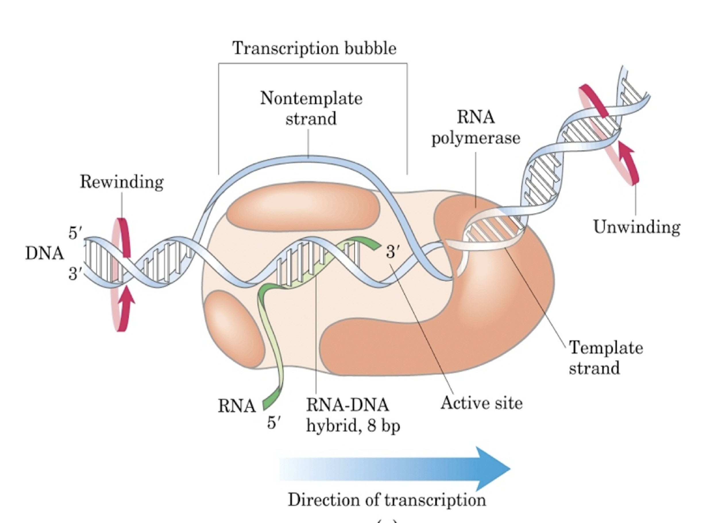
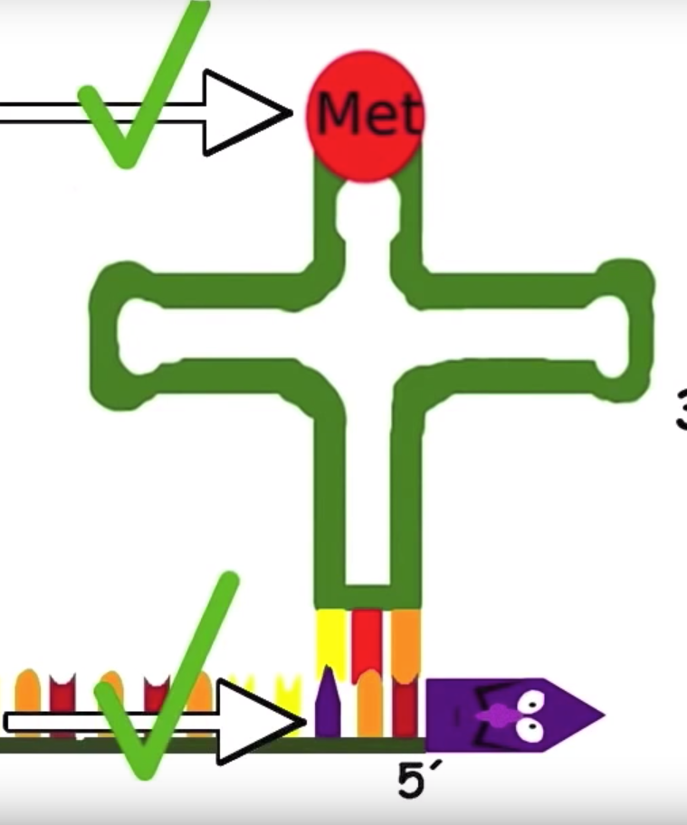
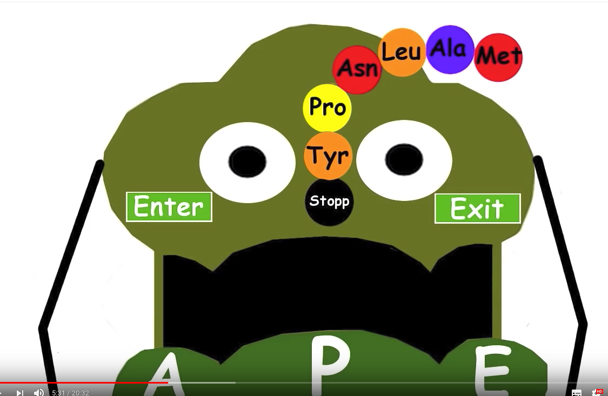

# Zentrales Dogma der Molekularbiologie

- DNA
    - ständige Replikation
- Transkription zu RNA
- Translation zu Proteinen

# Replikation bei Prokaryoten
- Semikonservativ &rightarrow; an beiden Strängen gleichzeitig 

## Replikationsschema der DNA
### 3 versch. Hypothesen
- Konservativ?
    - &rightarrow; Die DNA bleibt immer erhalten, ein zweite, völlig neuer entsteht
-Semikonservativ? 
    - &rightarrow; ein DNA Strang bleibt erhalten, daran bildet sich ein neuer Strang
- Dispersiv?
    - &rightarrow; nur Teile eines Stranges bleiben erhalten, der Rest bildet sich neu

### Antwort durch Meselson-Stahl-Experiment
- Züchtung von Bakterien auf Stickstoffisotopen mit unterschiedlichem Gewicht 
    - &rightarrow; Stickstoff wird in die DNA mit eiingebaut

- Bakterien wurden erst auf Medium mit schwerem Stickstoff gezüchtet
    - &rightarrow; nur schwere DNA
- Anschließende Überführung der Bakterien auf Medium mit leichtem Stickstoff für Replikation
- Nutzung des Dichtegradientenverfahrens &rightarrow; Auftrennung der Stoffe entlang ihrer Dichte
    - &rightarrow; **Ergebnis**: DNA hatte immer die selbe Dichte, das heißt, eine Konservative Teilung kann ausgeschlossen werden, da hier leichte und schwere DNA hätte entstehen müssen 

- Experiment wurde wiederholt, die Bakterien wurden nun länger auf leichtem Nährmedium gelassen, so dass sich ihre DNA zweimal teilen konnte 
    - &rightarrow; **Ergebnis**: nach mehreren Replikationen gibt es schwere und leichte DNA, deshalb kann Dispersive Teilung ausgeschlossen werden 

## Consensus-Sequenz
- Theoretische Nukleotidsequenz, in der Nukleotid das in natürlichen Sequenzen an häufigsten Vorkommende ist 

## Start der Replikation

### Origin of Replication
- Nicht kodierende Stelle der DNA, an der DNA Polymerase für Replikation bindet

### Wichtige Schritte
- DnaA Protein öffnet Doppelstrang an ORI
- DnaB Helikase trennt Elternstränge und entspiralisiert DNA mit Hilfe von DnaC
- Topoisomerasen beseitigen Spannung in Strang 
- ssb-Proteine stabilisieren aufgetrennte DNA-Stränge
- Primase synthetisiert an 3' Ende v. Nukleotiden den Primer
    - Primer &rightarrow; markiert Startpunkt für die Replikation
- DNA-Polymerase 3 beginnt in 5'-3' Richtung mit Synthese

### Helikasen
- &rightarrow; Enzyme, die Struktur von doppelsträngigen Nukleinsäuren verändern

## Ablauf Replikation 

### Okazaki-Fragmente
- Synthese von DNA nur von 5' in 3' Richtung möglich
    - Antiparalleler Strang wird nur stückweise synthetisiert und hier muss etwa alle 60 Nukleotide ein Primer gesetzt werden

### DNA-Polymerase 1
- Entfernen von Primern und ersetzen mit DNA

### DNA-Polymerase 2 
- Reparatur &rightarrow; Auffüllen von Gaps

### DNA-Polymerase 3
- Synthetisieren von DNA von 5'-3'
- Proof-Reading
    - &rightarrow; Exonuklease-Aktivität erkennt fehlerhaft eingesetzt Nukleotide und entfernt diese, so das sie durch Polymerase-Aktivität wieder aufgefüllt werden kann

### DNA-Ligase
- Verbindung von Okazi-Fragmenten
    - &rightarrow; Ligase verknüpft OH-Gruppe mit Phosphatrest von nebenliegendem Nukleotid

### Zusammenfassung
- Initiation am ORI 
- Elongation &rightarrow; Synthetisierung von DNA durch Polymerase 3
- Ligation &rightarrow; Verbindung von Ozaki-Fragmenten

### Replikationsgabel

## Fehler

### Allgemein 
- Sehr seltene spontane Mutation durch DNA-Polymerase 3 Proof Reading
- Etwa jede 10^10 Base wird falsch repliziert 

### Ursachen von DNA-Schäden 
1. UV-Strahlung
2. Alkylierende Agentien (Veränderung von Basen)
3. Interkalierende Agentien (Deletion / Insertion)
4. Ionisierende Strahlung (Veränderte Basen, Strangbrüche)

### UV-Strahlung 
- Benachbarte Nukleotide entwickeln kovalente Bindung 

- Photolyase
    - &rightarrow; Lösen unter Einwirkung von Licht kovalente Bindung zwischen den Nukleotiden wieder auf
- Nukleotid-Excisionsreparatur (NER)
    -Erkennt Schaden durch Verformung der Helix-Struktur
    - Schneidet Teil der DNA ab
    - Neusynthetisierung des fehlenden Teiles durch DNA-Polymerase

### Basen-Excisionsreparatur (BER)
- Kann bei Ursache 2 und 4 Fehler beheben 
- Glycolase erkennt Fehlstelle und entfernt Base
- AP-Endonuclease & dRpase beschneidet das Backbone 
-Lückenschließung durch DNA-Pol 1 und Ligase

### Mismatch-Reparatur
- Entfernen von nicht passender Base 

### SOS-Reparatur
- Bei größeren Schäden 
- Notfallreparatur &rightarrow; viele Fehler, meist nicht erfolgreich
- Ohne Reparatur keine Replikation möglich!

## Promotersequenzen
- Kennzeichnet beginn eines Genes
- Nicht kodierende Stellen in der DNA, an denen RNA Polymerase für Transkription bindet

## Terminatorsequenz
- Zeigt an, wann ein Gen zu ende ist 

# Transkription 

## Allgemein 
- Erfolgt durch RNA-Polymerase
- Nur ein DNA Strang wird in Downstreamrichtung als Vorlage für RNA genutzt
- Transkription von einzelnen Genen (DNA Sequenz, die ein Protein codiert)

## RNA
- Ribose als Zucker, anstatt Desoxyribose bei DNA
- Uraciel anstelle von Thymin

## Downstream & Upstream 
- Downstream &rightarrow; in Richtung von 3' Ende der DNA
- Upstream &rightarrow; in Richtung von 5' Ende der DNA

## Ablauf
- RNA-Polymerase bindet an Promotor (Promoter enthält meist TATAA und GC-Box Consensus-Sequenz)
    - Bei Eukaryonten hilft der Transkriptionsfaktor 2 bei der Erkennung des Promotors 
- DNA-Abschnitt wird unter Mithilfe von DNA-Polymerase abgelesen und komplementäre RNA wird gebaut
- Polyadenylierungsstelle (5’-AAUAAA-3’) dient als Terminator. Durch Hilfsprotein wird dieses erkannt und das Ende der Trankription eingeleitet

## Schutz / Postprocessing der RNA
- **Capping** &rightarrow; am 5' Ende wird GTP hinzugefügt um schnellen Abbau der RNA zu verhindern 
- **Polyadenylierung** &rightarrow; am 3' Ende werden viele A-Reste angehangen
- **Splicing** &rightarrow; Introns (nicht codierende Genabschnitte) werden herausgeschnitten, Extrons zusammengeführt

## Genorganisation 
- **mono-cistronisch** &rightarrow; ein Gen wird durch einen Promotor kontrolliert
- **poly-cistronisch** &rightarrow; mehrere Gene werden über gemeinsamen Promotor reguliert
    - Vorteil: Zusammengehörige Proteine werden gemeinsam synthetisiert

## Genregulation - Operon Modell
- Sogenannter Repressor bindet an Operator und verhindert Bindung von DNA-Polymerase &rightarrow; keine Trankription möglich 
- Ein Induktor (z.B. Lactose) kann an Repressorprotein binden, dadurch verliert der Repressor die Bindung zum Operator und es kann eine Transkription des Genabschnittes stattfinden
- Bei Transkription entstehen Enzyme, die den Indktuktor wieder abbauen &rightarrow; nach Transkription bindet der Repressor wieder an Operator und verhindert erneute Transkription

### Operon 
- Genabschnitt mit: 
    - Promotor
    - Operator
    - Strukturgenen

# Translation 
- Herstellung von Protein aus RNA

## Codierung
- Proteine bestehen aus Aminosäuren. Insgesamt 20 versch. Aminosäuren
- Basentriplet / Codon steht für eine bestimmte Aminosäure. Hierbei gibt es auch:
    - Startcodon AUG &rightarrow; Met
    - Stopcodon 

## tRNA 
- Bindet an der einen Seite drei Nukleotide (Anticodon) und an anderen Seite eine Aminosäure, die zum Codon passt
- Wird bei Translation verwendet, um Aminosäure an RNA zu binden

## Aufbau Ribosom
- Eingangsstelle / Erkennungsort (**A**)
- Polypeptidstelle (**P**)
    - Aminosäurekette entsteht hier
- Ausgangsstelle (**E**)

## Shine-Dalgarno-Sequenz
- Befindet sich auf der mRNA
- Erkennungssequenz für das Ribosom für die Richtung der Translation
- Initiationsfaktoren binden daran

## Ablauf Translation 
### Initiation
- RNA wird mit Startcodon an A-Stelle des Ribosoms geschoben 
### Elongation (Verlängerung von Aminosäurenkette)
- tRNA mit Aminosäure bindet an Start-Codon
- RNA wird eine Stelle weiter geschoben
    - Startcodon steht an P-Stelle
    - nächstes Codon steht an A-Stelle
- tRNA mit Aminosäure bindet an der A-Stelle 
    - &rightarrow; Prätranslationaler Zustand
- Aminosäure von P-Stelle wird auf die Aminosäure der A-Stelle übertragen 
- Peptidyl-Transferase Enzym stellt Peptidbindung zwischen den Aminosäuren her
- RNA wandert ein Codon weiter
    - &rightarrow; Posttranslationaler Zustand
- an A-Stelle wird neue tRNA gebunden, an A-Stelle wird leere tRNA abgestoßen 
- Vorgang wiederholt sich 
### Terminierung
- Wenn Stop-Codon erreicht ist

## Nukleasenaktivität 
- Hilft beim Abbau von Neukleotiden auf der RNA

### Questions: 
Bei Missmatch-Reparatur --> Wie kann man sicherstellen, welches die nicht passende Base ist? 

