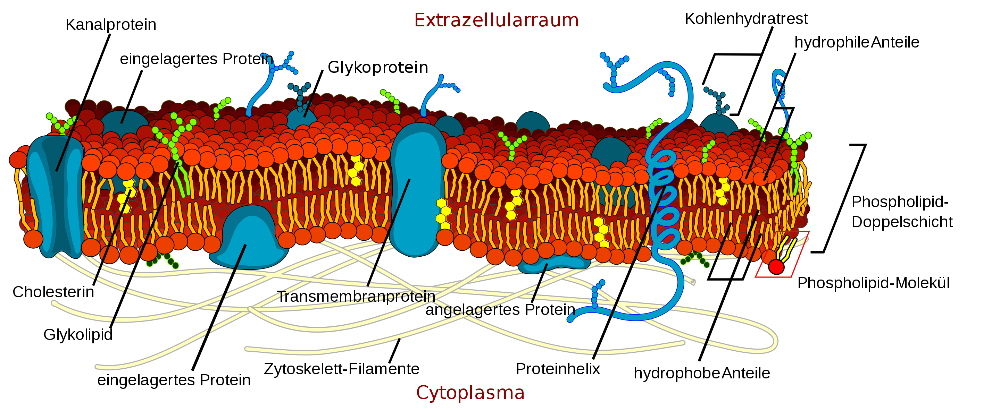

# Zellbiologie

## Pro- und Eukaryoten 
- Prokaryotische Zelle 
    - kein Zellkern, keine weiteren Organellen
- Eukaryotische Zelle 
    - Wesentlich komplexer
    - z.B. Tier- und Menschenzelle

## Endosymbionten Theorie
- Enstehung eukaryotischer Zellen aus Symbiose von prokaryotischen Vorläuferorganismen
 ### Zwischenschritte
1. Kompartimentierung von DNA in Zellkern + Ansiedlung von Ribosomen in ER um Zellkern herum
    - Von Prokaryotischer Zelle hin zur traditionellen eukaryotischen Zelle
2. Aufnahme von Bakterium ins innere der Zelle &rightarrow; Dient nun als Energiefabrik / Mitochondrium
    - Von tradioneller eukaryotischer Zelle hin zur früher eukaryotisches Zelle
3. Aufnahme von photosynthetischen Bakterien 
    - Von früher eukaryotischen Zelle hi zum eukaryoten mit Fähigkeit zur Photosynthese

## Grundlagen der Biochemie

### Stoffgruppen

## Questions
Was ist Golgi-Apparat & Lysosom & Peroxisomen?

## Struktureller Aufbau eukaryotischer Zelle 
### Inhalte einer typischen eukaryotischen Zelle

1. Nucleolus (Kernkörperchen)
2. Zellkern (Nukleus)
3. Ribosomen
4. Vesikel 
5. Raues endoplasmatisches Retikulum
6. Golgi-Apparat
7. Mikrotubuli
8. Glattes endoplasmatisches Retikulum
9. Mitochondrien 
10. Lysosom 
11. Cytoplasma
12. Peroxisomen
13. Zentriolen 
- **Quelle**: https://de.wikipedia.org/wiki/Zelle_(Biologie)#/media/File:Biological_cell.svg

- **Wichtig**: Im Gegensatz zur gezeigten Abbildung kommt es oft vor, das Inhalte mehrfach vorkommen (mehrere Mitochondrien oder Mikrotubuli)

### Hiraische Anordnung der Bestandteile

- Zellmembran 
    - Zellwand (bei Pflanzenzellen)
- Protoplasma (Inhalt)
    - Zellkern 
    - Cytoplasma
        - Cytosol
        - Organellen
            - ohne Membran 
                - Ribosomen 
                - Cytoskelett
            - mit Membran 
                - mit einfacher Membran 
                - mit doppelter Membran

## Zellmembran

-**Quelle**:  https://de.wikipedia.org/wiki/Zellmembran#/media/File:Cell_membrane_detailed_diagram_de.svg
### Aufbau
- Membranproteine mit bestimmten Aufgaben 
    - Transportproteine
    - Versch. Arten von Membranproteinen
        - Integrale Membranproteine (in der Membran)
        - Periphere Membranproteine (An Membran angelagert)
    - Glycolisierung von Proteinen und Lipiden
        - Anlagerung von Zuckerresten (Extrazellulär)
        - Wichtig für Interaktion der Zelle mit Umgebung
- Lipiddoppelschicht (z.B. Phosholipide)
    - amphipathisch: Bildung von Lipiddoppelschicht in Wasser (Köpfe richten sich zum Wasser hin aus, Schwänze zeigen vom Wasser weg)
        - &rightarrow; Energetisch optimaler Zustand: Kugelform
    - Unterschied zwischen gesättigten und ungesättigten Lipiden &rightarrow; Dicke der Membran und Fluidität wird beeinflusst. Viele ungesättigte Fettsäuren &rightarrow; Hohe Fluidität (Flexibler)
- Cholesterin in Membran zwischen Lipiden 
    - Bei normaler Temparatur mindert es Fludität weil es die Beweglichkeit der Lipide einschränkt
    - Bei niedriger Temp. stört es die Regelmäßige Anordnung der Lipide und hindert die Membran am fest werden
### Eigenschaften
- Asymetrischer Aufbau (Glycolisierung z.B. nur Extrazellulär)
- Flüssig &rightarrow; Beweglichkeit innerhalb der Membran (Laterale Diffusion, Rotation, Flip-Flop)
zwischen 6 - 10 nm dick
### Funktionen
- Signalübertragung 
- Zellwachstum und Beweglichkeit
- Transport kleiner Moleküle 
    - Verschiedene Transportmöglichkeiten aufzählen 
    - Passive Diffusion
        - Transport von Stoffe ohne Aufwendung von Energie
        - Ausgleich von Konzentrationsgefälle
        - 02, CO2 ... (Versch. Gase)
    - Osmose 
        - Austausch von Wassermolekühlen durch Zellmembran um Konzentration von Lösungen auszugleichen
    - Facilitated / Erleichterte Diffusion 
        - Erfordert Transportprotein (Carrier)
        - Ohne Energieverbrauch, nur durch Transformationsänderung 
        - z.B. Glucosetransport 
    - Aktiver Transport
        - Erfordert Energie zum Transport 
        - Primärer Transport &rightarrow; Transport durch ATP
            - ATP-getriebene Pumpe
                - Verbrauchen Energie durch Hydrolyse von ATP um Ionen entgegen des Gradienten zu trnasportieren
        - Sekundärer Transport &rightarrow; Wird durch Ionengradientfluss angetrieben
            - Ionenkanäle &rightarrow; Erleichtert den Transport entlang eines Gradienten
            - Transporter (Transport von Molekülen unter Nutzung von bestimmten Ionengradient)
                - Ionen werden entlang des Gradienten transportiert und Energie wird zum Transport anderer Moleküle genutzt
                - Symporter &rightarrow; Transport in Richtung des Gradientenflusses
                - Antiporter &rightarrow; Transport entgegen des Gradientflusses

## Zellkern (Nukleus)

### Aufbau 
- Innere und äußere Membran
    - Kernporen 
        - Regelung von Input und Output
- Kernlamina
    - Gibt Kernhülle Form und Stabilität 
    - Verankerungspunkt für Chromatin 
- Grundsubstanz (Nukleoplasma)
- Chromosomen mit dem Chromatin 
- Nukleolus (Kernkörperchen)
    - Produktion von ribisomalen Untereinheiten 

### Funktionen 
- Speichern, Erhalten und Verdoppeln von Erbinformationen (Replikation)
- Synthese von RNA anhand von DNA (Transkription)
- Zusammensetzung von ribosomalen Untereinheiten

### Kernporen 
- dienen zur Filterung von Input und Output
    - Input:
        - Histone --> Protein-Stäbe, die DNA aufwickelt
        - DNA / RNA Polymerase (Katalysiert die Polymerisation von einzelnen Nukleotiden zu einer langen Kette)
    - Output
        - mRNA & tRNA
        - ribosomale Untereinheiten
    - Freie Diffusion für kleinere Moleküle möglich
- Import und Exportrezeptoren regeln, was die Poren passieren darf
- Import in Zellkern (Nutzung von Importinen bzw. Exportinen)
    - Kernlokalisationssignal heftet sich an Protein (Adressaufkleber, Importin)
    - Protein samt Lokalisationssignal darf Importrezeptor passieren 
    - Kernlokalisationssignal löst sich im Kern wieder von Protein 

### Einteilung von RNA 
- mRNA &rightarrow; messenger RNA zur Proteinbiosynthese
- tRNA &rightarrow; transferiert von DNA zur mRNA
- rRNA &rightarrow; ist am Aufbau und Funktion von Ribosomen beteiligt

## Endomembransystem
- Organellen mit Membran (Golgi, Lysosome, ER, Mitochondrium, Vakuolen, Vesikel, Kernhülle) können miteinander verbunden sein 
    - *direkt* &rightarrow; physischer Kontakt
    - *indirekt* &rightarrow; über Vesikel
- Jede Membran ist asymetrisch im Bezug auf ihre Lipid- und Proteinbestandteile
    - *Cytosolic face* Seite die zum Cytosol hin zeigt
    - *Exoplasmic face*

### Vesikel 
- Bläschen aus Zellmebran, welches im inneren Stoffe enthalten kann
- Transport von Stoffen von einer zu anderen Membran 
- Ablauf
    - Vesikel mit Adressinformation spaltet sich von Membran ab
    - geschlossenes Vesikel wird zu Ziel transportiert
    - Vesikel dockt an Zielmembran an und wird geöffnet
- **Pulse-chase Experiment**
    - Radioaktive Markierung einiger im ER gebildeter Proteine 

## Cytosol 
- Flüssiger Bestandteil des Cytoplasma
- Ort der Proteinsynthese und -abbau (An Ribosomen)
- Stoffwechsel (Transport von Stoffen innerhalb des Zellkörpers)
- Struktur durch Cytoskelett 
- Viele Polysomen
    - &rightarrow; ` Aneinanderreihung von Ribosomen`
- Viele Enzyme die an Stoffwechsel beteiligt sind
    - `Enzym: Biologisches Riesenmolekühl, welches als Katalysator eine chemische Rkt. beschleunigen kann.`

## Endoplasmatisches Retikulum 
- Endoplasmatisch &rightarrow; im Cytoplasma
- Retikulum &rightarrow; Netzwerk
- Kernmembran geht in ER über
- System aus verbundenen Hohlräumen 

### Glattes ER (ohne Ribosomen)
#### Funktionen 
- Synthese von: 
    - Lipiden 
    - Phoshoplipiden
    - Steroiden (u.a. Hormone und Geschlechtshormone)
- Calciumspeicher
- Kohlenhydratspeicher 
- Spielt wichtige Rolle bei Kohlenhydratstoffwechsel
- Mithilfe zur *Entgiftung* körperfremder Stoffe 
    - Durch anfügen einer polaren Gruppe wird Wasserlöslichkeit von Stoffe erhöht &rightarrow; können durch Niere besser ausgeschieden werden = nierengängig 

### Raues ER (Mit Ribosomen)
#### Funktionen 
- Besetzt mit Ribosomen &rightarrow; Proteinbiosynthese
    - Synthetisierte Ribosomen werden nach Produktion an den Ribosomen direkt in ER transportiert
- Glycolisierung von Proteinen im Lumen der ER
    - *Lumen* &rightarrow; innerer (Hohl)raum von Organellen
- Abstaltung von Vesikeln
- Membranproduktion

## Ribisomen 
- Ort der Proteinbiosymthese 
    - &rightarrow; `Translation`, Übersetzung von mRNA in Abfolge von Aminosäuresequenz (Polypeptid, Protein)

- Translation im Cytosol 
    1. Pool aus freien Ribosomen steht im Cytosol bereit
    2. mRNA heftet sich an freies Ribosom 
    3. Aneinanderreihung mehrere Ribosomen mit gebundener mRNA zu Polyribosom
    4. Bildung des in mRNA codierten Proteins
    - 
- Translation ins ER hinein
    1. Pool aus freien Ribosomen steht im Cytosol bereit
    2. mRNA heftet sich an freies Ribosomen und der Anfang eines Polypeptids wird gebildet (Am Ende steht eine ER Signal Sequenz)
    3. Anheften der ER Signalsequenz an Membran des ER 
    4. Bildung von Polyribosom an ER 
    5. Bildung des komletten Proteins + Abgabe in ER Lumen 
    -
## Mikrotubuli 
- Formgebend / Stabilisierung der Zelle 
- "Schienen", an denen sich u.a. Dynein und Kinesin fortbewegen könnnen
- MTOC - Microtubule Organizing Center &rightarrow; Zentrum, in denen Mikrotubuli entstehen (z.B. Centrosom)

